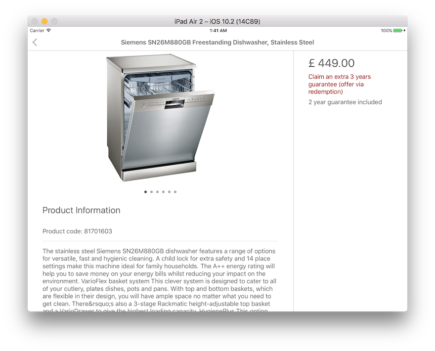
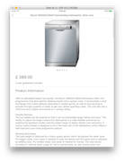

##<a name="dishwasher-app">Dishwasher App</a>
John Lewis Partnership **iOS Developer** Technical Test

  


##<a name="intro">Intro</a>
Hi there.

This repository contains my John Lewis Partnership iOS Developer Technical Test. Please feel free to get in touch with any questions or queries you may have. I will be more than happy to get back to you as soon as possible. 

<matthewpharding@gmail.com> 

In the meantime, hopefully this README file will tell you all you need to know.
🙂
 

##<a name="requirements">Requirements</a>
 
* The App should work on an iPad, in landscape and portrait mode.
	* The DishwasherApp is an **iPad** only app, working in all orientations. 

	
    

* The code should be written in Objective-C, Swift or both.
	* The code is written in **Swift 3.0**.
* The use of third party Code/SDKs is allowed, but you should be able to explain why you have chosen the third party.
	* Third party libraries have been implemented using the CocoaPods dependancy manager for two small purposes.
		1. Local **image caching**. [Kingfisher](#third-party-library-kingfisher)
		2. **JSON parsing** library. [Argo](#third-party-library-argo)

* We’d like to see a TDD approach to writing the app.
	* **Test Driven Development** has been utilised to design the architecture and generate testable chunks of code, also encapsulating any business logic. 

* When submitting your app to us, we expect the code to build and run using the latest version of Xcode that is currently available in the Apple App Store.
	* The project was created using the latest version of Xcode **Version 8.2.1 (8C1002)**.
* Committing your code constantly to a GitHub Account.
	* a ```GitHub``` account has been used alongside ```GitFlow``` as a branching strategy.
* Putting all your assumptions, notes and instructions into your GitHub README.md
	* All assumptions are outlined within the [Assumptions](#assumptions) section below.


##<a name="the-approach">The Approach</a>

> We’re not looking for a ‘pixel perfect’ app, we are looking at your style of coding, and how you’ve approached this.

####UI

Taking the structure of the test into consideration the architecture has maintained the focus together with structuring the core logic of the application. The visual layer behaves as expected with an additional loading/ retry state for failed requests. Any minor differences with the attached wireframes/ designs are intensional and outlined in the [Assumptions](#assumptions) section.

####TTD Driving the Design

Tests were created before and alongside the creation of any components driving the design of the architecture and class hierarchy, (although in this case we favour structs over classes). Adopting this approach helps to ensure strong dependancy injection, loose coupling, high cohesion with a testable design. 

####Protocols

Protocols offer a contract without the knowledge of any concrete implementations and have been key in the flexibility and testability of this project.

####Separating out the Presentation Layer
The logic has been separated out into two main areas

1. **The core logic**
2. **The presentation layer**

		
An iOS application is no longer confined to one platform. TVOS, Apple Watch and other key extensions will likely share the same core components. For this reason and future expansion we must ensue this separation exists from our initial implementation. 
**The core logic** will encapsulate and centralise the logic to communicate with services specific to the product and not the visual capabilities of the device.
**The presentation** will restrict itself to the visual representation of the data provided by the underlying system.


####Layered Architecture

	Presentation
	Feature
	Product API
	Parsing
	Networking
	URL Requests

A strict set of layers has been implemented to maintain clear abstraction and separation of responsibilities. In the event of these layers requiring large refactoring the task will remain relatively painless as each layer is properly confined. Each piece of data has been processed and passed up the levels with new error types and their own type of data manipulation (if any). The only exception being the models which have been kept to the same type for the sake of simplicity in this coding test.

####Product API -  Dishwasher or Toaster?
Although this test is geared towards dishwasher appliances, the architectural layout and design has ben structured for a generic product search api which will return a list of products. Without the use of a search bar the ```SearchViewController``` has been hard coded with a search term that can be easily changed.

####Self Documenting Code 
As you will see throughout the project, code comments have been kept to a minimum allowing the swift syntax and descriptive naming to document themselves. This approach reduces future over head and will prevent out of date comments not relevant to their current context. 

####Storyboards, Segues and .XIBs 
As you know storyboards have several advantages and can be a real pleasure to work with. The overall navigational view, rapid development speed and use of container views (to name a few) are especially a benefit. However, there are also some limitations such as prototype cell reuse and cognitive overload with complicated layouts. For this reason I have utilised the benefit of both tools, implementing storyboards for their descriptive navigational overview and use of container views aiding more complex embedded behaviours and implementing .xib files for tableview cells for re-use and to prevent long lists of embedded prototype cells cluttering the storyboard scene. 


## <a name="third-party-library">Third Party Libraries</a>


###<a name="third-party-library-argo">Argo</a> *JSON Parser* 	
<https://cocoapods.org/pods/Argo>

Rather than writing verbose and complicated parsing algorithms for data constructed in the JSON format I have added a library, which is widely used in the iOS community. This addition will provide a proven approach to mapping JSON data to model objects, save development time and ensure a structured aligned process is applied to converting this data.

###<a name="third-party-library-kingfisher">Kingfisher</a> *Image Caching*	
<https://cocoapods.org/pods/Kingfisher>

A common approach on mobile is to introduce a local caching strategy for image data, where we can keep the assets stored locally for a small period of time. This will lower networking calls, increase performance and enhance the user experience by ensuring pleasing artwork is available as quickly as possible. For these reasons I have introduced this caching library.

## <a name="assumptions">Assumptions/ Notes</a>

####Product Information Format
The format of the **product information** property (within the product detail response) is HTML. Similarly implemented values were all received in plain text. As the design screenshots do not suggest HTML was implemented as a conscious design choice, I have cleaned the data removing any HTML formatting and added consistency with the design.

####Design Screenshots as a Guide
Although the final implementation matches the design screenshots to a high degree there are some differences. Such as the **Read More** option which would be displayed when the description would span over a maximum height (as far as I understand from the screenshot). This functionality would not be difficult to implement, however as it was not mentioned within the requirements or specification I have used any extra time to focus more on the approach and core logic.

The padding of the tableview cell imageviews and tableview line breaks also differ slightly from the design. This is also intentional.

####Retry Feature 
I have added the ability to recover from a failed network request on both screens. Although this functionality works well, it has been added for completeness and as a precaution in the event that a **test reviewer** may have a lossy data connection. I am aware that this feature could be refined further.
